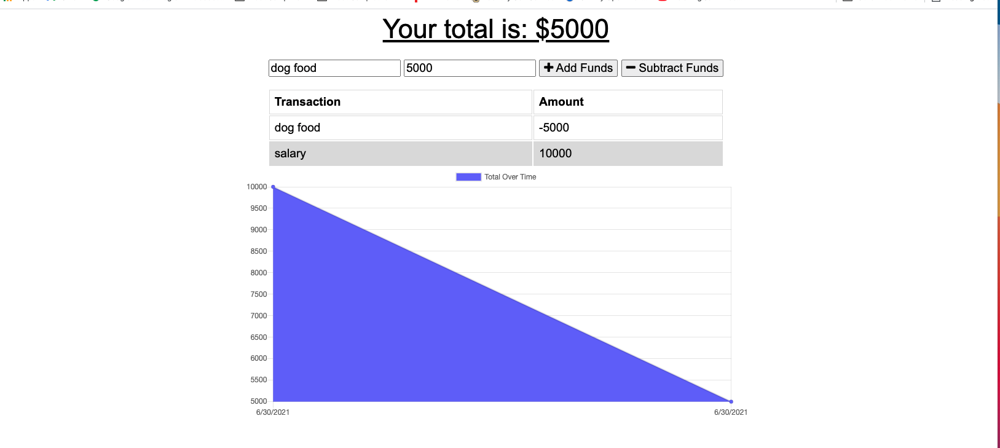
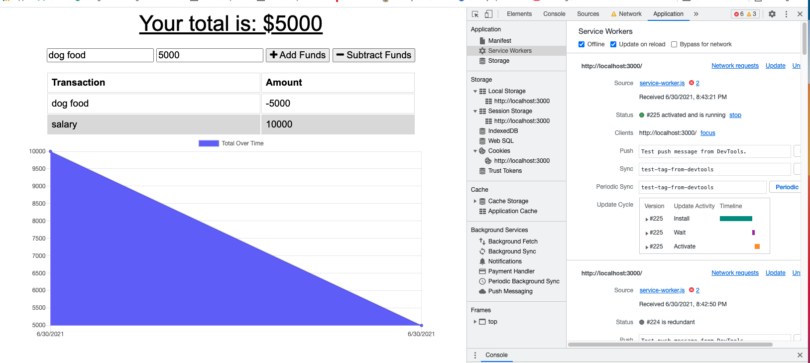

# Online-Offline-Budget-Tracker

## Table of Contents

1. [Title](#title)
2. [Description](#Description)
3. [Installation](#Installation)
4. [Technologies](#Technologies)
5. [Collaboration](#Collaboration)
6. [Steps](#Steps)
7. [Walkthrough](#Screenshot)

# Description

- AS AN avid traveller
  I WANT to be able to track my withdrawals and deposits with or without a data/internet connection
  SO THAT my account balance is accurate when I am traveling

# Installation

- To install: npm start

## Links

- https://github.com/MelElson/Online-Offline-Budget-Tracker
- https://stormy-crag-14195.herokuapp.com

# Technologies

The site uses Javascript, Node,js, Inquirer, Express, MYSQL, Mongo,Webpack,Service Worker

# Collaboration

Pulls are encouraged. Any changes document.

# Steps

The user will be able to add expenses and deposits to their budget with or without a connection. When entering transactions offline, they should populate the total when brought back online.

Offline Functionality:

- Enter deposits offline

- Enter expenses offline

When brought back online:

- Offline entries should be added to tracker.

# Screenshot

